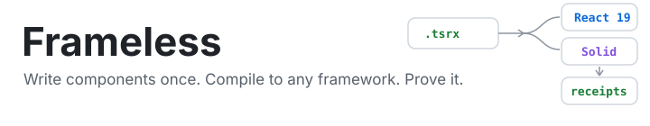
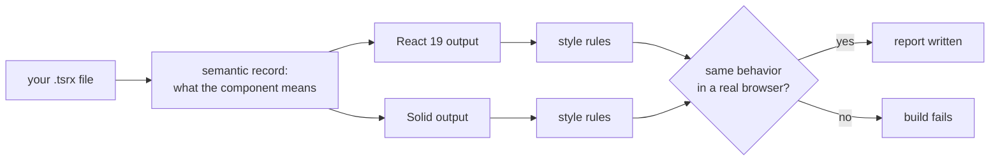

<picture>
  <source media="(prefers-color-scheme: dark)" srcset="assets/banner-dark.svg">
  
</picture>

Write your components once. Compile them to any framework. Get code that looks
hand-written and provably works the same everywhere.

You write `.tsrx` files: HTML-like markup, JavaScript variables, plain reads
and writes. Frameless records what your component does (state, events,
updates) and generates real framework code from that record. No wrapper, no
runtime layer. Solid output uses signals. React output uses hooks and works
with the React ecosystem. When we add a resumable framework, that output will
be resumable.

```tsx
import { state } from '@frameless.md/core';

export function Counter() @{
  let count = state(0);

  <button onClick={() => count++}>
    Clicked {count}
  </button>
}
```

From that one file:

<table>
<tr>
<th>React 19 output</th>
<th>Solid output</th>
</tr>
<tr>
<td>

```jsx
const [count, setCount] = useState(0);
// on click:
// const nextCount = count + 1;
// setCount(nextCount);
```

</td>
<td>

```jsx
const [count, setCount] = createSignal(0);
// on click:
// setCount(count() + 1);
// reads stay count()
```

</td>
</tr>
</table>

Every output is checked against style rules for its framework, and every rule
has a test proving it can catch a violation. Then both outputs run in a real
headless browser against the same scripted actions, and their behavior is
compared: DOM, callbacks, list identity, focus. Match, and a report file is
written. Mismatch, and the build fails.



## Try It

```sh
pnpm install
pnpm e2e
```

Builds both demo libraries (`demos/ui-kit` and `demos/composition-kit`, which
has cross-file imports, children, shared state, and element access with
cleanup) into React 19 and Solid, runs them in a headless browser, and writes
a report under each demo's `receipts/` folder.

## Why Not the Alternatives?

| Alternative                | How it works                                                                              | The catch                                                                                                                                                           |
| -------------------------- | ----------------------------------------------------------------------------------------- | ------------------------------------------------------------------------------------------------------------------------------------------------------------------- |
| **Mitosis**                | Translates a restricted JSX dialect, syntax to syntax. More targets than Frameless today. | Every framework gets the same lowest-common-denominator component. Verified by string snapshots, not behavior. Unsupported patterns can quietly produce wrong code. |
| **AI ports per framework** | An AI rewrites your component for each framework.                                         | It is a guess. It changes every run, it can quietly change behavior, and someone has to review every file for every framework after every change.                   |
| **Hand-written ports**     | You maintain one codebase per framework.                                                  | N times the work, N times the bugs, and drift the moment one port gets a fix the others do not.                                                                     |
| **Web components**         | One runtime shared by every framework.                                                    | Native to none of them. Friction around props, events, and SSR.                                                                                                     |

Frameless takes the other road: compile a semantic record of what your
component means, emit what each framework's own best practice calls for,
reject what it cannot prove, and verify behavior in a real browser.

> [!TIP]
> AI and Frameless work best together. Let AI write your Frameless components
> (one small model to be good at, instead of five frameworks to be mediocre
> at) and let the compiler carry them everywhere with proof.

> [!NOTE]
> Need hand-maintained framework code someday? Start from the compiled
> output. It is real, idiomatic code. Eject when you get there, not before.

## What It Does Not Do

The browser tests cover the scripted scenarios in the demos, not every
possible program. SSR behavior is proven for CLI-emitted React and Solid output;
accessibility and performance are not yet proven.

Frameworks are not forced to copy each other. The same component may compile
to different shapes in React and Solid when that is each framework's own best
practice. Each framework owns its style. The tests own the proof that behavior
matches.

## How We Test

- Generated output is committed, and tests fail if it drifts.
- Every style rule has a test proving it catches a bad output.
- The browser tests are calibrated against intentionally broken components
  first, so we know they can fail.
- The demo command's report cannot be produced dishonestly; the build fails
  instead.
- Every finished milestone was verified from a fresh clone. The decision trail
  lives under `docs/goals/`.

## Packages

| Package                     | What it does                                                   |
| --------------------------- | -------------------------------------------------------------- |
| `packages/compiler`         | Compiles `.tsrx` into a record of component meaning.           |
| `packages/analyzer`         | Runs browser scenarios and compares behavior.                  |
| `packages/frameworks/react` | Generates and checks React 19 output.                          |
| `packages/frameworks/solid` | Generates and checks Solid output.                             |
| `packages/cli`              | Builds many files at once and writes build reports.            |
| `demos/`                    | The two demo libraries. `poc/` is early evidence, not product. |

## Status

| Milestone                                                                                    | Status                                  |
| -------------------------------------------------------------------------------------------- | --------------------------------------- |
| **v0**: single components (state, derived values, events, keyed lists, conditionals, inputs) | ✅ Shipped, verified from a fresh clone |
| **Composition**: children, shared state, element access with cleanup                         | ✅ Shipped, verified from a fresh clone |
| Shared state across files, named slots                                                       | Planned                                 |
| SSR tests                                                                                    | Proven (behavioral, via witness — `pnpm e2e`) |
| Saved state (localStorage): render-time reads → pre-paint seed + write-through                | Proven (behavioral, React/Solid, via witness — `pnpm e2e`) |
| More frameworks                                                                              | Planned                                 |

## Development

```sh
pnpm install
pnpm test
pnpm check
pnpm lint
pnpm fmt
pnpm build
pnpm e2e
```

Browser tests need the locally cached Playwright Chromium build. The SSR witness lane can also use
a system Chromium-family browser; see [demos/ssr/README.md](./demos/ssr/README.md) for provisioning
and receipt details. Read [CONTRIBUTING.md](./CONTRIBUTING.md) and [AGENTS.md](./AGENTS.md) before
changing the repo.

## Markless

Frameless components are API-compatible with
[Markless](https://github.com/markless-dev/markless), a resumable UI framework
that renders the same component model to web and native (UIKit, AppKit) with
no hydration and no virtual DOM. Frameless is built on the Markless compiler.
Same components, two ways to ship: run them on Markless, or compile them into
the framework your team already uses.

## Agent Guidance

AI agent rules come from [`.ruler/`](.ruler/), generated with
[Ruler](https://github.com/intellectronica/ruler) via `pnpm rules`.
`AGENTS.md` is generated. Edit `.ruler/` and rerun `pnpm rules`.
